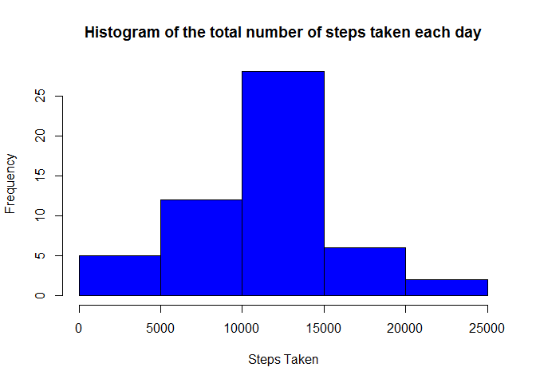
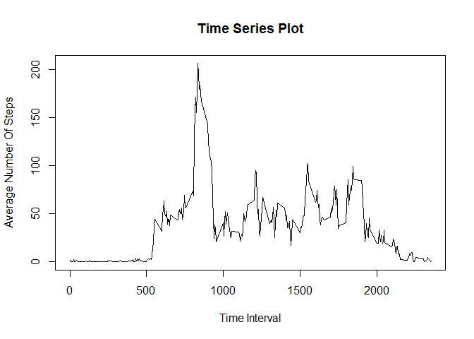
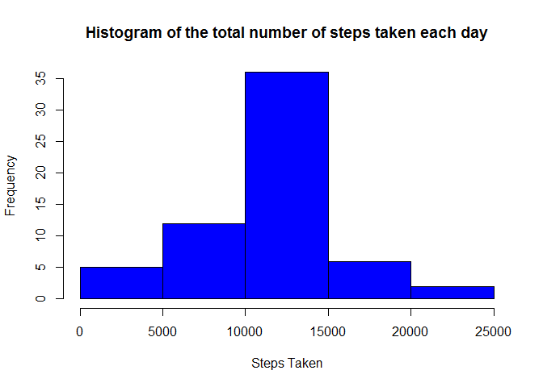
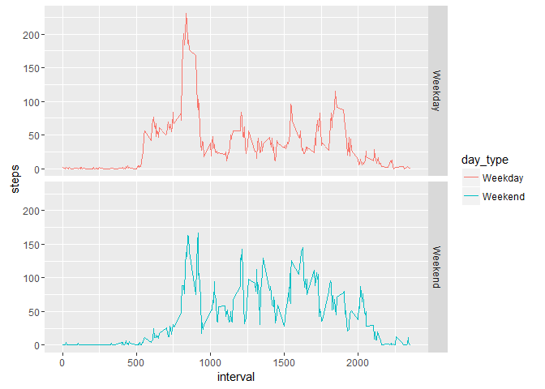

# Reproducible Research: Peer Assessment 1

##Loading and Processing Data

This section describes how the data was loaded and processed. 


```r
#load the data
setwd("C:/Users/zambezis/Desktop/Data Science Coursera/Reporducible research")
data <- read.csv("./RepData_PeerAssessment1/activity/activity.csv")
# process data, remove rows with missing values
analysis_data <- na.omit(data)
```

##What is the mean total number of steps taken per day

The dplyr function was used to first group the data accoding to take and there after peform the sumation of each date. The mean and median for the steps taken each day where calculated individually and thereafter added to a dataframe. 


```r
library(dplyr) 
```

```
## 
## Attaching package: 'dplyr'
```

```
## The following objects are masked from 'package:stats':
## 
##     filter, lag
```

```
## The following objects are masked from 'package:base':
## 
##     intersect, setdiff, setequal, union
```

```r
Steps<- analysis_data %>% group_by(date) %>% summarise(sum(steps))
hist(Steps$`sum(steps)`, xlab = "Steps Taken",main = "Histogram of the total number of steps taken each day", col = "blue")
```

<!-- -->

```r
# Calculate mean and median of the steps taken each day
mean_s <- mean(Steps$`sum(steps)`)
median_s <- median(Steps$`sum(steps)`)
# report on mean and median
z <- as.data.frame(matrix(c(mean_s,median_s), nrow = 1, ncol = 2))
colnames(z) <- c("Mean", "Median")
z
```

```
##       Mean Median
## 1 10766.19  10765
```

##What is the Average Daily Activity Pattern
1. A timeseries plot was created of the 5-minute interval vs average number of steps taken, averaged across all days
2. Computed the interval, on average across all days that has the maximum number of steps 

```r
#Average daily activity pattern
Avg_Steps<- analysis_data %>% group_by(interval) %>% summarise(mean(steps))
plot(x = Avg_Steps$interval, y = Avg_Steps$`mean(steps)`, type = "l", xlab = "Time Interval", ylab = "Average Number Of Steps", main = "Time Series Plot")
```

<!-- -->

```r
#Obtain interval with maximum number of steps
subset(Avg_Steps, Avg_Steps$`mean(steps)`== max(Avg_Steps$`mean(steps)`), select = c(interval))
```

```
## # A tibble: 1 x 1
##   interval
##      <int>
## 1      835
```

##Imputing missing values

1. Calculated and reported on number of days/intervals where there are missing values. 
2. filled in all missing values in the data based on the average steps in that interval accross all days.


```r
# report on the number of missing values
# Get all rows with missing values as a seperate dataset 
df_2 <- data[!complete.cases(data),]
nrow(df_2)
```

```
## [1] 2304
```

```r
#Inputing missing values
#loop through all rows of the data
#identify the average steps for that interval in Avg_Steps
#replace NA value in df_2 with that value

for (i in 1:nrow(df_2)) {
   value_m <- Avg_Steps$`mean(steps)`[which(Avg_Steps$interval== data$interval[i])]
   df_2$steps[i] <- value_m }
# join the data sets
df_3<- rbind(df_2,analysis_data)
#steps per day with new data set
Steps_new<- df_3 %>% group_by(date) %>% summarise(sum(steps))
hist(Steps_new$`sum(steps)`, xlab = "Steps Taken",main = "Histogram of the total number of steps taken each day", col = "blue")
```

<!-- -->

```r
# Calculate mean and median of the steps taken each day
mean_s2 <- mean(Steps_new$`sum(steps)`)
median_s2 <- median(Steps_new$`sum(steps)`)
# report on mean and median
w <- as.data.frame(matrix(c(mean_s2,median_s2), nrow = 1, ncol = 2))
colnames(w) <- c("Mean", "Median")
w
```

```
##       Mean   Median
## 1 10766.19 10766.19
```

The mean and median values for the new data set are not different from the orginal data set that did not include missing values. 

##Are there differences in activty patterns between weekdays and weekends?


```r
#change to date factor
df_4 <-df_3
df_4$date <- as.Date(df_4$date)
#Change to weekdays
df_4$date <- weekdays.Date(df_4$date)
#change to character vector
df_4$date <- as.character(df_4$date)

# create factor variable indicating whether a given date is a weekday or weekend day.
df_4$date[df_4$date == "Saturday"] = "Weekend"
df_4$date[df_4$date == "Sunday"] = "Weekend"
df_4$date[df_4$date == "Monday"] = "Weekday"
df_4$date[df_4$date == "Tuesday"] = "Weekday"
df_4$date[df_4$date == "Wednesday"] = "Weekday"
df_4$date[df_4$date == "Thursday"] = "Weekday"
df_4$date[df_4$date == "Friday"] = "Weekday"

#merge with full data set
df_5 <- cbind(df_3, df_4$date)
colnames(df_5) <- c("steps", "date", "interval", "day_type")
Avg_Steps_3 <- aggregate(steps ~ interval + day_type, df_5, mean)
#plot data
library(ggplot2)
p1 <- ggplot(Avg_Steps_3, aes(x = interval, y = steps)) + geom_line(stat = "identity", aes(colour = day_type)) + facet_grid(day_type~.)
p1
```

<!-- -->

Yes, there apears to be a difference between the two patterns (weekends and weekdays). The weekdays pattern appear to have greater variance. 
